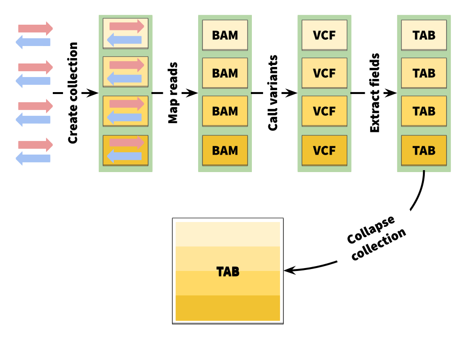

# NGS-data-logistics

The Story
To make this tutorial as realistic as possible we wanted to use an example from the real world. We will start with four sequencing datasets (fastq files) representing four individuals positive for malaria—a life-threatening disease caused by Plasmodium parasites—transmitted to humans through the bites of infected female Anopheles mosquitoes.

Our goal is to understand whether the malaria parasite (Plasmodium falciparum) infecting these individuals is resistant to Pyrimethamine—an antimalarial drug. Resistance to Pyrimethamine is conferred by a mutation in PF3D7_0417200 (dhfr) gene (Cowman et al. 1988). Given sequencing data from four individuals we will determine which one of them is infected with a Plasmodium falciparum carrying mutations in this gene.

An outline of my analysis looks like this:
## Collection Lifecycle

  

Figure 1: This analysis begins with a set of fastq files representing four individuals. The sequencing was performed using a paired-end protocol. This means that each sample is represented by two files: forward reads (red) and reverse reads (blue). Before analysis begins these files are combined into a Collection. This allows processing all of them at once. The data is mapped against a reference genome of P. falciparum. This produces a series of BAM files. The BAM files are further passed through a variant caller. This produces VCF files. VCF files are then converted to tabular format and concatenated to create one final dataset. This dataset contains the answer to our question: which of the individual carries drug resistant mutations.

------------

From reads to variants
----------
In this tutorial I will use data from four infected individuals sequenced within the MalariaGen effort. I use the following four samples:

Accession	Location
ERR636434	Ivory coast
ERR636028	Ivory coast
ERR042232	Colombia
ERR042228	Colombia
These accessions correspond to datasets stored in the Sequence Read Archive at NCBI.
